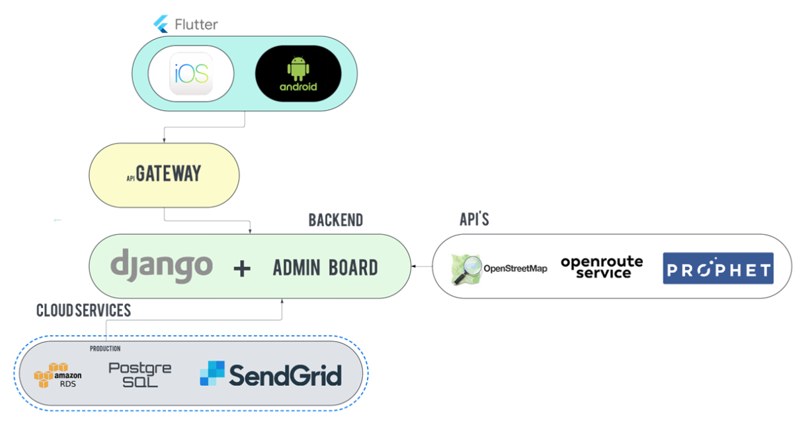
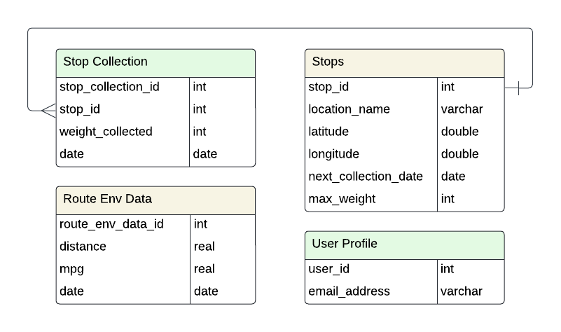
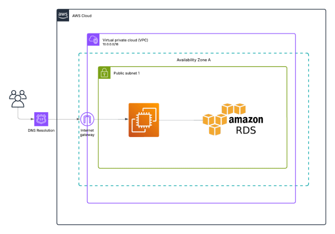

# AI-Enhanced Waste Collection Handover Document

## Contents
- [Introduction](#Introduction)
- [Build and Execution] (#Build-and-Execution)
- [System Architecture] (#System-Architecture)
- [Project Structure] (#Project-Structure)
- [Database Structure] (#Database-Structure)
- [AWS Setup] (#AWS Setup)
- [Further Documentation] (#Further_Documentation)

## Introduction 
This document contains all the essential information required for handover. Including the structure of our project and everything required to takeover development.
Additional information can be found in the README.md in the root directory and under the Further Documentation section.

## Build and Execution

### Requirements/Prerequisites 

| Requirements | Download Instruction | Version | Notes|
| ---------- | -------------------- | ----- | 
| Flutter SDK | https://docs.flutter.dev/get-started/install | Use latest version. | Use for frontend development, follow the install instructions on the flutter website to install the SDK correctly. |
| Python | https://www.python.org/downloads/ | 3.12 or later | Used backend development. | 
| Android Studios | https://developer.android.com/studio/install | | Used to create android emulators for Android app development. |
| Android SDK and Command Line Tools | SDK manager in android studios. | Version 14 and later. | Required to build android apps. |
| XCode | https://apps.apple.com/gb/app/xcode/id497799835?mt=12 | Latest | Used for iOS development and running iOS simulator. |
| Python dependencies | ```pip install -r requirements.txt``` | Defined in requirements.txt | This will get all the python packages needed. |
| Flutter dependencies | ```flutter pub get``` | Defined in pubspec.yaml | This will get all the flutter dependencies needed. |  

For more information on flutter and android sdk set up view our set up guide view here.[#docs/set-up-guide/fronend-flutter.md]

### Clone Repository

Clone the repository:
``` git clone https://github.com/spe-uob/2024-AIEnhancedWasteCollection.git ```

### Setup Environment Variables - Backend
For the project to run there needs to be a ```.env``` file int the root directory of the backend. This is located at ```/2024-AIEnhancedWasteCollection/ewc_backend/```.
This ```.env``` file should contain:
```env
DJANGO_SECRET_KEY = "YOUR_DJANGO_SECRET_KEY"
POSTGRES_USER = "YOUR_DATABASE_USERNAME"
POSTGRES_PASSWORD = "YOUR_DATABASE_PASSWORD"
POSTGRES_HOST = "YOUR_DATABASE_HOST"
POSTGRES_PORT = "YOUR_DATABASE_PORT"

# Additional ENV for password reset & encryption
SENDGRID_SECRET_KEY="YOUR_SENDGRID_API_KEY"    # for password reset email

```

### Setup Environment Variables - Frontend
You also need to have an ```.env``` file in the root directory of the backend. This is located at ```/2024-AIEnhancedWasteCollection/ewc_frontend/```.
This ```.env``` file should contain:
```env
API_KEY="YOUR_ORS_SECRET_KEY"
ENCRYPTION_KEY="YOUR_ENCRYPTION_KEY"
```

> [!NOTE]
> Note that the value so these environment variables will need to be set to the correct values instead of the placeholders. If these values are changed the github secretes also need to be updated in order for the continuous deployment to function correctly. 

### Running the application 
In order to run the application correctly, the backend Django server must be running. To start the server run
```
python manage.py migrate
python manage.py runserver
```
This will run the server on http://127.0.0.1:8000

To run the front end, start either an android or iOS emulator, then run

```
flutter run
```

> [!NOTE]
> If you are running an android emulator you may need to change the apiURL and adminURL in the auth_service.dart file to 10.0.2.2 inorder to connect to the backend correctly.

### Running the application test
We have developed tests for both the frontend and backend.
To run the frontend (flutter) tests, navigate to the frontend root directory (```2024-AIEnhancedWasteCollection/ewc_frontend/```)and run:

```flutter test```

To run the backend (django) tests, navigate to the backend root directory (```2024-AIEnhancedWasteCollection/ewc_backend/```) and run: 

```python manage.py test ewc_core.tests```

For more information about testing, view our testing documentation [#TESTING_GUIDE]

## System Architecture 
The system architecture for this project is 


## Project Structure
The main structure for the project is as followed:
```bash
2024-AIEnhancedWasteCollection
├── .github/                       
│   ├── ISSUE_TEMPLATE/            # templates for Kanban Issues
│   │   ├── ...
│   ├── workflows/                 # for CI and CD
│   │   ├── ...
│   ├── pull_request_template.md
├── docs/                          # Contains documentation, meeting minuets, research etc.
├── ewc_backend/                   # Django-based backend
│   ├── ewc_admin/                 # Django project-level config
│   │   ├── __init__.py
│   │   ├── asgi.py                # ASGI entry point
│   │   ├── settings.py            # Django settings (DB config, installed apps)
│   │   ├── urls.py                # Root URL routes
│   │   └── wsgi.py                # WSGI entry point
│   ├── ewc_core/                  # Core Django app containing actual logic
│   │   ├── migrations/            # DB migration files (auto-generated)
│   │   ├── ml_model/              # ML-related code (Prophet, model training)
│   │   ├── tests/                 # Django unit tests
│   │   ├── admin.py               # Django admin site configurations
│   │   ├── apps.py                # Django app config
│   │   ├── forms.py               # Django forms
│   │   ├── models.py              # Django models (UserProfile, Stops, etc.)
│   │   ├── serializers.py         # DRF serializers
│   │   └── views.py               # DRF views / endpoints
│   ├── templates/                 # Django HTML templates
│   ├── .dockerignore
│   ├── .gitignore
│   ├── docker-compose.yml         # Docker Compose for the backend
│   ├── dockerfile                 # Docker build for the backend
│   ├── manage.py                  # Django CLI entry point
│   └── requirements.txt           # Python dependencies
├── ewc_frontend/                  # Flutter-based mobile frontend
│   ├── android/                   # Android-specific config (Gradle, Manifest)
│   ├── assets/                    # Images, logos, etc.
│   ├── build/                     # Generated build files
│   ├── fonts/                     # Custom font files
│   ├── ios/                       # iOS-specific config (Info.plist, Xcode)
│   ├── lib/                       # Main Flutter/Dart source
│   │   ├── models/                # Data models (Dart side)
│   │   ├── notifiers/             # ChangeNotifier classes
│   │   ├── screens/               # Flutter UI screens (login, register, etc.)
│   │   ├── services/              # API services, AuthService, etc.
│   │   ├── theme/                 # App-wide theme settings
│   │   └── widgets/               # Reusable widgets (buttons, textfields, dialogs)
│   ├── linux/
│   ├── macos/
│   ├── test/                      # Flutter widget/unit tests
│   ├── web/
│   ├── windows/
│   ├── .dockerignore
│   ├── .gitignore
│   ├── analysis_options.yaml      # Lint rules
│   ├── devtools_options.yaml
│   ├── docker-compose.yml         # Docker Compose for frontend
│   ├── dockerfile                 # Docker build for the frontend
│   ├── pubspec.lock               # Locked Flutter package versions
│   ├── pubspec.yaml               # Flutter dependencies & project config
│   └── main.dart                  # main entry for the Flutter app
├── LICENSE
├── README.md                      # Project readme
├── requirements.txt               # Backend requirements (used for CD)
└── ... (others like EWC-ReleaseChecklist.pdf,  etc.)
```

## Database Structure
The structure of the database is as followed:



During development our database is hosted on Neon, for deployment we host our database on AWS.

## AWS Setup

The setup of our AWS is as followed:


You can access the deployed version of the Django server via ```https://devnest.software/admin/```

